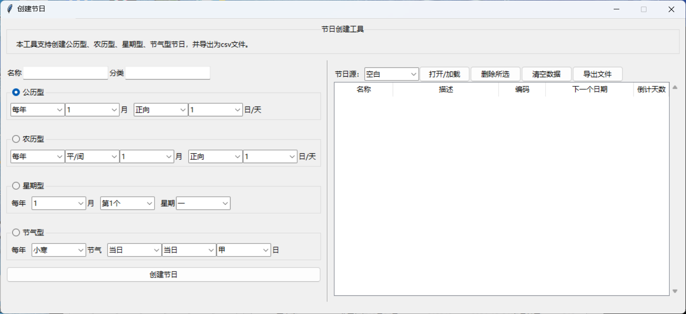

# Borax日历应用程序

> New in 4.1.0

从 Borax 4.1.0 开始，Borax 提供两个基于 Borax.Calendar 的日历应用。

| 应用程序 | 功能 | 启动命令 |
| ---- | ---- | ---- |
| 日历应用 | 公农历日期显示，及其他日期工具 | `python -m borax.capp` |
| 节日创建器 | 创建节日库 | `python -m borax.capp creator` |

## 日历应用

主要功能：

- 显示带有基本节日的日历
- 日期计算工具

## 节日创建器

主要功能：

- 创建节日
- 导出 csv文件