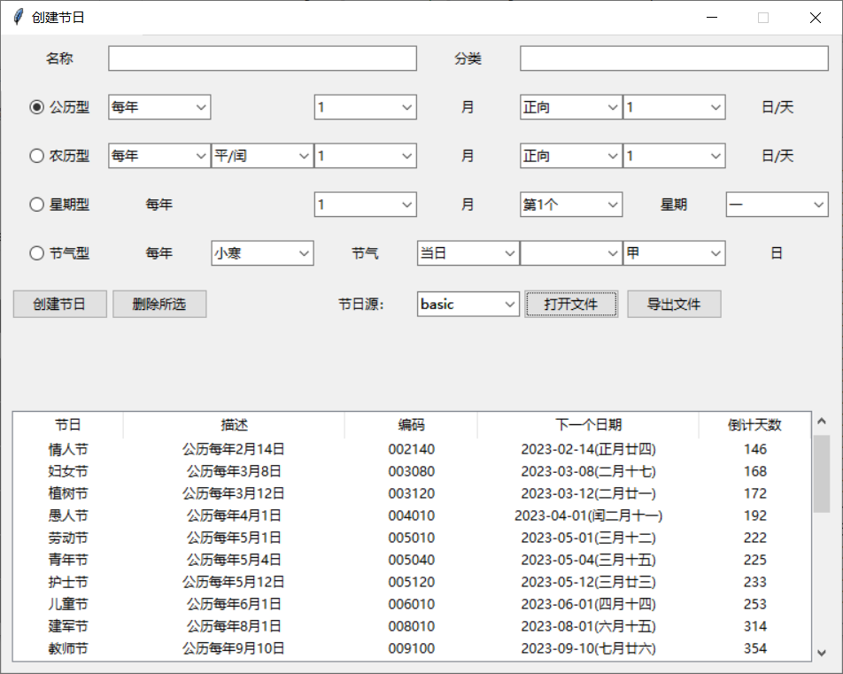

# 日历界面库

> Add in 4.0.0

本模块提供了若干个可重用的基于 `tkinter.ttk` 的界面组件。

## 日历组件：CalendarFrame

```
borax.calendars.ui.CalendarFrame
```

### 创建组件

CalendarFrame实现了一个简单的公农历组件，该类继承自 `ttk.Frame` 。使用方法如下：

```python
from borax.calendars.festivals2 import WrappedDate
from borax.calendars.ui import CalendarFrame

def on_date_picked(self, wd: WrappedDate):
    print(wd)

cf = CalendarFrame(master, firstweekday=0)
cf.bind_date_selected(on_date_picked)
cf.pack(side='top', expand=True, fill=tk.X)
```

构造函数的参数及其意义如下：

| 参数                                               | 描述         | 说明                                                       |
| -------------------------------------------------- | ------------ | ---------------------------------------------------------- |
| firstweekday:int = 0                               | 首列星期     | 0星期一，6星期日 <sup>1</sup>。                            |
| year:int = 0                                       | 初始公历年份 | year=0或month=0情况下，默认为本月                          |
| month:int = 0                                      | 初始公历月份 |                                                            |
| festival_source:Union[str,FestivalLibrary]='empty' | 节日库来源   | 可使用内置源或自定义源。即使不设置节日源，也会显示24节气。 |
| kw                                                 | 关键字参数   | 参见 `ttk.Frame` 类                                        |

备注：

1. 参数意义同 `calendar.Calendar`的 `firstweekway` 。注意：不能使用 `calendar.MONDAY` 等常量。


例如：使用自定义节日源

```python

my_library = FestivalLibrary.load_file('./my_festivals.csv')

bcw = CalendarFrame(master, festival_source=my_library)
```


### 事件绑定

`CalendarFrame` 支持使用 `bind_*` 方式设置事件响应函数。

| 事件名称             | Handler函数签名               | 描述                       |
| -------------------- | ----------------------------- | -------------------------- |
| `bind_date_selected` | `handle(wd:WrappedDate)`      | 点击日期单元格的响应函数。 |
| `bind_page_changed`  | `handle(year:int, month:int)` |                            |

### 布局

建议使用 pack 布局。

### 属性和方法

**year_and_month**

返回当前页面的年月。

**翻页page_to**

将日历翻页到指定月份，trigger控制是否触发 PageChanged 事件。有以下四种使用方式：

```python
def CalendarFrame.page_to() # 本月
def CalendarFrame.page_to(month_offset:int) #向前/后几月
def CalendarFrame.page_to(year:int, month:int) # 指定月份
def CalendarFrame.page_to(year:int, month:int, month_offset:int) # 指定月份之前后的月份
```

示例

```python
cf.page_to()  # 当前月
cf.page_to(1)  # 下一月
cf.page_to(-1)  # 上一月
cf.page_to(2022, 9)  # 指定月
cf.page_to(2022, 9, 1)  # 2022年9月的下一个月
```

更为复杂的起止日期选择。

```python
start_f = CalendarFrame()

sy, sm = start_f.year_and_month
end_f = CalendarFrame()
end_f.page_to(sy, sm, 1) # 结束日期选择框设置为开始日期的下一个月

```

## 节日表格组件 FestivalTableFrame

```
borax.calendars.ui.FestivalTableFrame
```


### 概述

`FestivalTableFrame` 可显示一个 `FestivalLibrary`对象的所有节日，主要功能：

- 按表格显示所有节日
- 按类别、倒计天数排序
- 添加新节日
- 删除已有节日

界面如下：




### 创建组件

```python
ftf = FestivalTableFrame(master=None, colunms:Sequeue=None, source: str = 'empty',  **kwargs)
```

构建参数及其意义如下：

| 参数            | 描述             | 说明 |
| --------------- | ---------------- | ---- |
| colunms:Sequeue | 列定义           |      |
| source:str      | 节日源，默认为空 |      |

表格列定义方式如下：

```python
# 只定义列名，宽度默认为200px
colums = ('name','description', 'code')

# 定义列名合宽度
columns = (("name", 100), ("description", 200), ("code", 120), ("next_day", 200), ("countdown", 100))
```

可用的列如下表：

| 名称        | 描述               | 示例 |
| ----------- | ------------------ | ---- |
| name        | 名称               |      |
| code        | 编码               |      |
| description | 描述字符串         |      |
| next_day    | 下一个日期         |      |
| ndays       | 下一个日期倒计天数 |      |

