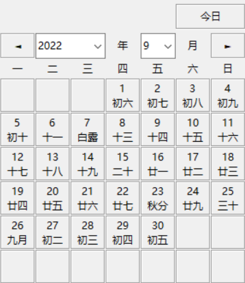
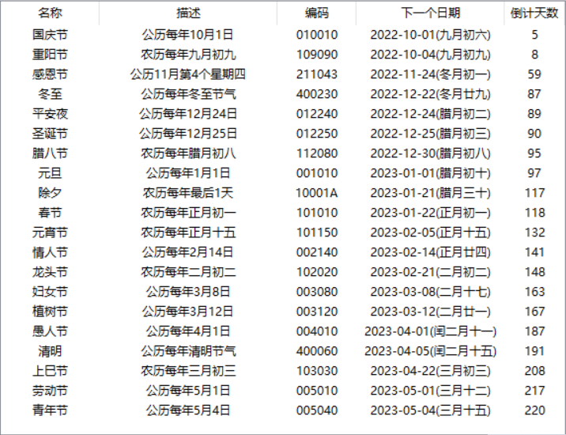

# 日历界面库

> Add in 4.0.0

本模块提供了若干个可重用的基于 `tkinter.ttk` 的界面组件。

| 组件         | 类                                    |
| ------------ | ------------------------------------- |
| 日历组件     | borax.calendars.ui.CalendarFrame      |
| 节日表格组件 | borax.calendars.ui.FestivalTableFrame |
| 日期选择框   | borax.calendars.datepicker.ask_date   |


## 日历组件：CalendarFrame




### 创建组件

CalendarFrame实现了一个简单的公农历组件，该类继承自 `ttk.Frame` 。使用方法如下：

```python
from borax.calendars.festivals2 import WrappedDate
from borax.calendars.ui import CalendarFrame

def on_date_picked(self, wd: WrappedDate):
    print(wd)

cf = CalendarFrame(master, firstweekday=0)
cf.bind_date_selected(on_date_picked)
cf.pack(side='top', expand=True, fill=tk.X)
```

构造函数的参数及其意义如下：

| 参数                                               | 描述         | 说明                                                       |
| -------------------------------------------------- | ------------ | ---------------------------------------------------------- |
| firstweekday:int = 0                               | 首列星期     | 0星期一，6星期日 <sup>1</sup>。                            |
| year:int = 0                                       | 初始公历年份 | year=0或month=0情况下，默认为本月                          |
| month:int = 0                                      | 初始公历月份 |                                                            |
| festival_source:Union[str,FestivalLibrary]='empty' | 节日库来源   | 可使用内置源或自定义源。即使不设置节日源，也会显示24节气。 |
| kw                                                 | 关键字参数   | 参见 `ttk.Frame` 类                                        |

备注：

1. 参数意义同 `calendar.Calendar`的 `firstweekway` 。注意：不能使用 `calendar.MONDAY` 等常量。


例如：使用自定义节日源

```python
from borax.calendars.festivals2 import FestivalLibrary
from borax.calendars.ui import CalendarFrame

my_library = FestivalLibrary.load_file('./my_festivals.csv')
cf = CalendarFrame(master, festival_source=my_library)
```


### 事件绑定

`CalendarFrame` 支持使用 `bind_*` 方式设置事件响应函数。

| 事件名称             | Handler函数签名               | 描述                       |
| -------------------- | ----------------------------- | -------------------------- |
| `bind_date_selected` | `handle(wd:WrappedDate)`      | 点击日期单元格的响应函数。 |
| `bind_page_changed`  | `handle(year:int, month:int)` |                            |

### 布局

建议使用 pack 布局。

### 属性和方法

- **year_and_month**

返回当前页面的年月。

- **翻页page_to**

将日历翻页到指定月份，trigger控制是否触发 PageChanged 事件。有以下四种使用方式：

```python
def CalendarFrame.page_to() # 本月
def CalendarFrame.page_to(month_offset:int) #向前/后几月
def CalendarFrame.page_to(year:int, month:int) # 指定月份
def CalendarFrame.page_to(year:int, month:int, month_offset:int) # 指定月份之前后的月份
```

示例

```python
cf.page_to()  # 当前月
cf.page_to(1)  # 下一月
cf.page_to(-1)  # 上一月
cf.page_to(2022, 9)  # 指定月
cf.page_to(2022, 9, 1)  # 2022年9月的下一个月
```


## 节日表格组件 FestivalTableFrame



### 概述

`FestivalTableFrame` 可显示一个 `FestivalLibrary`对象的所有节日，主要功能：

- 按表格显示所有节日
- 按类别、倒计天数排序
- 添加新节日
- 删除已有节日

### 创建组件

```python
FestivalTableFrame(master=None, colunms:Sequeue=None, festival_source:Union[str,FestivalLibrary]='empty', countdown_ordered:bool=False, **kwargs)
```

构建参数及其意义如下：

| 参数                                               | 描述                             |
| -------------------------------------------------- | -------------------------------- |
| colunms:Sequeue                                    | 列定义                           |
| festival_source:Union[str,FestivalLibrary]='empty' | 节日源，默认为空                 |
| countdown_ordered:bool=False                       | 是否按倒计天数排序。<sup>1</sup> |

备注：

1. v4.1.0新增。

表格列定义方式如下：

```python
# 只定义列名，宽度默认为200px
colums = ('name','description', 'code')

# 定义列名和宽度
columns = (("name", 100), ("description", 200), ("code", 120))
```

可用的列如下表：

| 名称        | 描述               |
| ----------- | ------------------ |
| name        | 名称               |
| code        | 编码               |
| description | 描述字符串         |
| next_day    | 下一个日期         |
| ndays       | 下一个日期倒计天数 |

### 属性

- **tree_view**

关联的树形组件。

- **festival_library**

组件关联的节日库对象。

- **row_count**

表格的条目数。

### 方法

- `add_festival(festival:Festival)`

添加新的节日。

- `add_festivals_from_library(library:FestivalLibrary)`

从另一个节日库添加多个节日。

- `delete_selected_festivals()`

删除所选择的节日，支持多选。

- `notify_data_changed()`

重新根据 `FestivalTableFrame.festival_library` 刷新表格数据。

例子

```python
ftf = FestivalTableFrame(festival_source='basic')
# ...
ftf.festival_library.sorted(key=lambda x:x.code)
ftf.notifiy_data_changed()
```

- `change_festival_source(source:str)`

v4.1.0新增。更新指定数据源。


## 日期选择框:ask_date

```python
def ask_date() -> Optional[WrappedDate]:
    pass
```

显示日期选择框，并返回选择的日期（类型为 `WrappedDate`），如果未选择，则返回 `None`。

```python
import tkinter as tk
from tkinter import ttk

from borax.calendars.datepicker import ask_date


def main():
    root = tk.Tk()
    root.title('日期选择器')
    root.resizable(False, False)
    date_var = tk.StringVar()
    entry = ttk.Entry(root, textvariable=date_var)
    entry.pack(side='left')

    def askdate():
        wd = ask_date()
        print(wd)
        if wd:
            date_var.set(wd)

    btn = ttk.Button(root, text='点击', command=askdate)
    btn.pack(side='left')
    root.mainloop()


if __name__ == '__main__':
    main()

```

